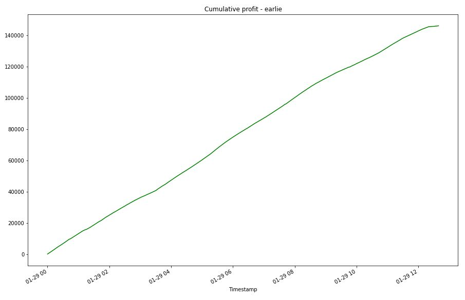

# Arbitrage analysis of purchaising of Bitcoin on Coinbase and Bitstamp

This analysis helps to determine profitbilitity of purchasing/sales of Bitcoin berween the two exchanges Coinbase and Bitstamp.

---

## Approach and phases of analizing

It follows this pattern: 
* collect, 
* prepare, 
and then 
* analyze.

---

## Technologies

This project leverages the following tools for financial analysis:

* [Pandas](https://pandas.pydata.org) - Python library that’s designed specifically for data analysis.

* [JupyterLab](https://jupyter.org) - For running and review Python-based programs.

---

## Input data

Input data is in the Resources folder:

* coinbase.csv - Bitcoin costs from 2018-01-01 to 2018-03-31
* bitstamp.csv - Bitcoin costs from 2018-01-01 to 2018-03-31

## Analizing summaries

The analizing is focused on two columns of data:
* Timestamp (index)
* Close

It were analized profitability for two periods: 
* earlie period and late period and 
* earlier, middle and late days.

An analysis of the entire period showed that the price of bitcoin did not differ greatly between both exchangers.
It is obvious when check plot and summary statistics.

Bitstamp:

```
count    129067.000000
mean      10459.842453
std        2315.976088
min        5944.000000
25%        8613.370000
50%       10145.950000
75%       11444.810000
max       17234.980000
```
Coinbase

```
count    129322.000000
mean      10449.140958
std        2317.197419
min        5882.310000
25%        8609.230000
50%       10137.440000
75%       11397.237500
max       17177.990000
```


### Earlie day - 2018-01-29

After reviewing the profit information across each date from the different time periods for the earlie date, we can see that profits accumulated at a consistent pace during the whole day, topped out as the almost day over and started to level off once the trades ceased to be profitable. It was the more profitable day because it contains 742 profitable trades during day, when returns exceed the transaction cost threshold of 1%. 
```
Profit per trade: min 111.2, max 300.27, ave 196.724070.
Sum of the profits is 145969.25999999995. (if transaction cost is 1%)
```

Summary - earlie day


Cumulative profit



### Middle day - 2018-02-15 and late day - 2018-03-20
```diff
- Note. !!! Since there are no positive returns > 1%, it will be analyzied positive returns > 0.1%.
```

```
Example for midle day:
count    0.0
mean     NaN
std      NaN
min      NaN
25%      NaN
50%      NaN
75%      NaN
max      NaN
```

For the middle and late days, the profits accumulated at a consistent pace in the early morning, the most profitable time is a noon part of the day. And after the 6 pm profitability starts to level off. Theese days are not profitable, because returns doesn't exceed the transaction cost threshold of 1%. 

```diff
!If we reduce transaction cost to 0.1%!
then profit per trade for the middle day: 
```
231 profit trades, min 9.84, max 48.8, ave 18.089524 and 
profit per trade for the late day: 106 profit trades, min 8.62, max 27.93, ave 12.869151.
Sum of the profits for middle day is 4178.6799999999985 (if transaction cost is 0.1%).
Sum of the profits for late day is 1364.130000000001. (if transaction cost is 0.1%).
```

Summary - middle day


Summary - late day


Cumulative profit - middle day


Cumulative profit - late day


---

## Contributors

Vladislav Glupak - [Linkedin](https://www.linkedin.com/in/vladislav-glupak/)

---

## License

It is an Open-source analysis.
